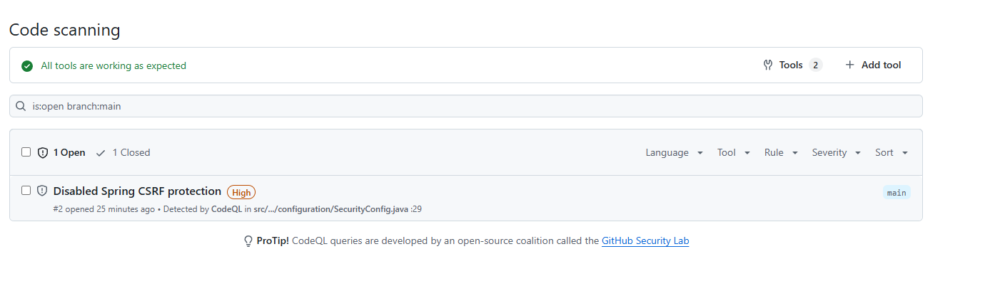
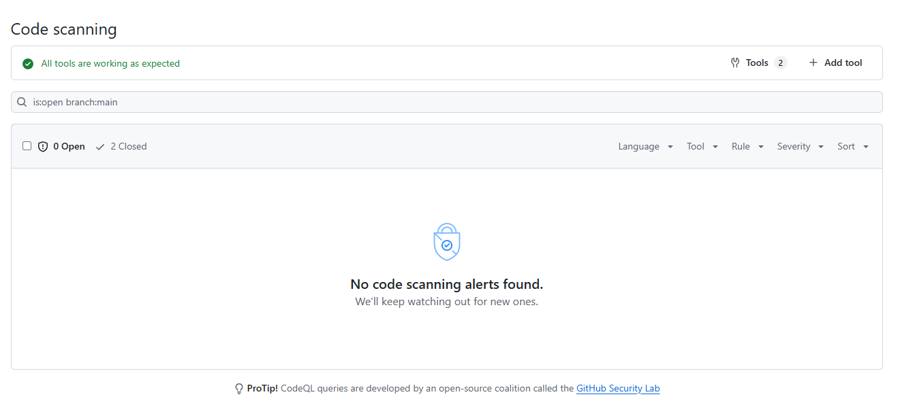
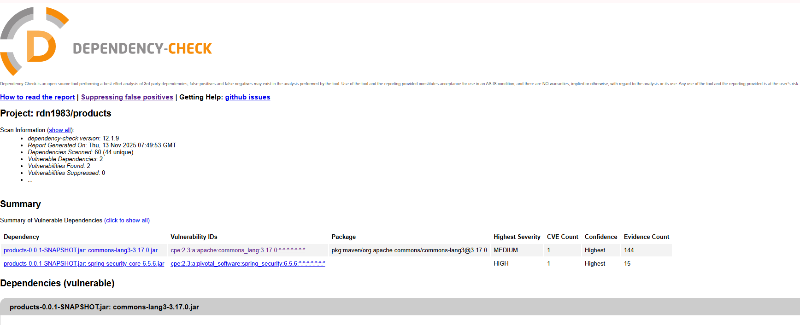

# Products API

Небольшой учебный REST‑сервис для управления сущностями "Product". Сервис реализует:
- Аутентификацию по логину/паролю и выдачу JWT токена
- Доступ к защищенным ресурсам по схеме Bearer JWT
- CRUD‑операции чтения/создания продуктов (в демо — чтение и создание)
- Встроенные меры защиты от XSS и SQL‑инъекций
- Инициализацию БД через миграции

## Технологии

- Java 17, Spring Boot 3.x
- Spring MVC (REST API)
- Spring Security (JWT Bearer, пароль с BCrypt)
- Spring Data JDBC (доступ к данным, PreparedStatement)
- Liquibase (миграции БД и загрузка справочников)
- H2 (встроенная СУБД для запуска/демо)
- Bean Validation (валидация входных DTO)
- MapStruct (маппинг сущностей и DTO)
- Lombok (генерация шаблонного кода)
- Logback (логирование)

## Быстрый старт

- Запуск: `mvn spring-boot:run`
- По умолчанию используется встроенная H2. Демо‑данные пользователей и ролей загружаются миграциями.
- Получение токена и вызов API см. разделы ниже и файл `dev-scenario.http`.

## Аутентификация и авторизация

- Способ: JWT Bearer (подпись HS256).
- Поток:
  1) Клиент вызывает публичный эндпоинт авторизации и передает `username` и `password`.
  2) Пароль проверяется через `AuthenticationManager`; пароли в БД хэшируются BCrypt.
  3) При успехе выдается JWT c subject = username и сроком истечения (по умолчанию 24 часа).
  4) Для доступа к защищенным ресурсам клиент передает заголовок `Authorization: Bearer <token>`.
- Токены проверяются на подпись и истечение, при валидном токене в `SecurityContext` выставляется аутентификация.
- Доступ:
  - Публично: `/auth/login`
  - Защищено (требуется Bearer JWT): `/api/data`

## Эндпоинты

Все ответы и запросы — JSON.

1) POST /auth/login
- Назначение: получить JWT токен
- Тело запроса:
  ```
  {
    "username": "string (1..100, обяз.)",
    "password": "string (1..255, обяз.)"
  }
  ```
- Пример ответа 200:
  ```
  { "token": "eyJhbGciOi..." }
  ```
- Коды:
  - 200 OK — токен выдан
  - 400 Bad Request — ошибки валидации
  - 401 Unauthorized — неверные учетные данные

2) GET /api/data
- Назначение: список продуктов
- Аутентификация: требуется `Authorization: Bearer <token>`
- Ответ 200:
  ```
  [
    {
      "id": "uuid",
      "createdBy": "string|null",
      "creationDate": "yyyy-MM-dd'T'HH:mm:ss",
      "modifiedBy": "string|null",
      "modificationDate": "yyyy-MM-dd'T'HH:mm:ss",
      "name": "string (1..500, обяз.)",
      "count": 0
    }
  ]
  ```
- Коды:
  - 200 OK
  - 401/403 — нет или неверная аутентификация/доступ

3) POST /api/data
- Назначение: создать продукт
- Аутентификация: требуется `Authorization: Bearer <token>`
- Тело запроса:
  ```
  {
    "name": "string (1..500, обяз.)",
    "count": 0
  }
  ```
  Допустимо также передавать `createdBy`/`modifiedBy`; даты и id проставляются автоматически.
- Ответ 201:
  ```
  {
    "id": "uuid",
    "createdBy": "string|null",
    "creationDate": "yyyy-MM-dd'T'HH:mm:ss",
    "modifiedBy": "string|null",
    "modificationDate": "yyyy-MM-dd'T'HH:mm:ss",
    "name": "string",
    "count": 0
  }
  ```
- Коды:
  - 201 Created
  - 400 Bad Request — ошибки валидации
  - 401/403 — нет или неверная аутентификация/доступ

Подсказка: примеры вызовов см. в `dev-scenario.http`.

## Меры защиты от XSS

В проекте используется несколько слоев защиты:

- Политики безопасности заголовков HTTP:
  - Content-Security-Policy (CSP) — строго запрещает выполнение скриптов и встраивание небезопасного контента, запрещены фреймы, ограничены источники.
  - Frame-Options: DENY — защита от кликовойджа.
  - HSTS — принудительный HTTPS (при работе за обратным прокси).

- Валидация и санитизация входных данных:
  - Проверка значений строковых полей DTO на наличие опасных конструкций (атрибуты типа `onload=`, `javascript:`, теги `<script>` и пр.).
  - Аннотации валидации на входных полях (ограничение длины, обязательность и т.п.) для уменьшения поверхности атак.

- Архитектурные решения:
  - API возвращает только JSON, отсутствует серверный рендеринг HTML — это устраняет классический XSS на стороне сервера.
  - Не используются небезопасные отражения пользовательского ввода в HTML.

Результат: входные данные, заголовки и параметры запросов проверяются и при выявлении опасных шаблонов запросы отклоняются до выполнения бизнес‑логики.

## Меры защиты от SQL‑инъекций

- Доступ к данным через Spring Data JDBC — все запросы параметризованы и выполняются через `PreparedStatement`.
- Встроенные запросы для аутентификации пользователей также используют плейсхолдеры `?` и не конкатенируют пользовательский ввод.
- Отсутствуют динамические SQL‑конструкции, формируемые строковой конкатенацией на основе пользовательских данных.
- Схема и начальные данные управляются миграциями Liquibase, что упрощает аудит и снижает риск ошибок при ручном изменении схемы.

## Модель данных

Сущности и таблицы (упрощенно):

- Product
  - id: UUID, PK
  - name: VARCHAR(500), not null
  - count: INT, not null (>= 0)
  - createdBy: VARCHAR(255), null
  - creationDate: TIMESTAMP, not null (аудит)
  - modifiedBy: VARCHAR(255), null
  - modificationDate: TIMESTAMP, null (аудит)

- Пользователи и роли (для аутентификации):
  - users
    - username: VARCHAR(100), PK
    - password: VARCHAR(255), not null (BCrypt)
    - enabled: BOOLEAN, not null
  - authorities
    - username: FK -> users.username
    - authority: VARCHAR, not null

Поля аудита автоматически заполняются на уровне сервиса/инфраструктуры.

## Статусы ошибок и обработка исключений

- Ошибки валидации входных DTO возвращаются как 400 Bad Request с человекочитаемыми сообщениями.
- Ошибки аутентификации — 401 Unauthorized (безопасные ответы без утечки деталей).
- Доступ без полномочий — 403 Forbidden.

## Отчеты по безопасности

При первоначальном сканировании статическим анализатором была найдена ошибка:
 

после исправления кода в классе SecurityConfig ошибка была устранена:


Также анализ зависимостей на уязвимости выявил 2 проблемные зависимости:


Проблему с commons-lang3 удалось решить, подняв версию до 3.18.0 и проблема была устранена.
Проблему с spring-security решить, к сожалению, не удалось, так как в проекте уже используется последняя стабильная версия и нужно ожидать исправлений со стороны разработчика библиотеки